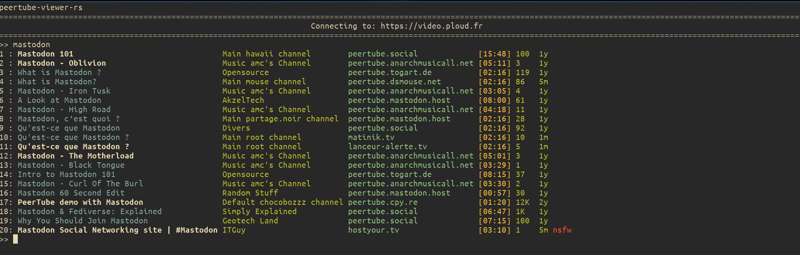
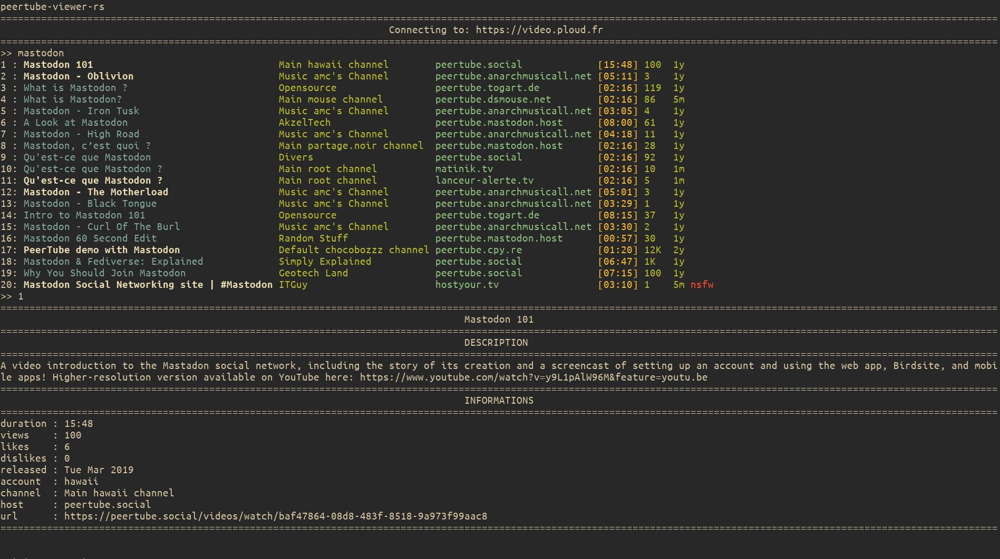

peertube-viewer-rs
===

https://peertube-viewer.com

A command line program to view and browse [PeerTube](https://joinpeertube.org), inspired by the youtube-viewer utility



Documentation
---

This readme provides a quick overview of peertube-viewer-rs. 

To learn how to install peertube-viewer, see [the download page ](https://peertube-viewer.com/download).
To learn how to use it, see [the documentation](https://docs.peertube-viewer.com).

Compiling
---

Compiling requires a [rust toolchain](https://www.rust-lang.org/tools/install) to be installed, newer that `v1.56`.

```bash
cargo build --locked --release
```

The executable can then be found in `target/release/peertube-viewer-rs`, while autocompletion for a few shells will be found in in the `completions` directory.

**peertube-viewer-rs** hasn't been tested on any platform other than linux.
Don't hesitate to open issues for bugs on other platforms.

Usage
---
Here is an example of basic usage :

The user wants to use the PeerTube instance video.ploud.fr. They search for videos about mastodon then they select the first search result. Additional information about the video is displayed and the video is launched. If no player has been chosen as argument and no player is selected in the config file, it will default to `mpv` to play the video. When the video has ended, the user can search other videos, play another search result or quit with :q.



For a more detailed usage description, checkout [the documentation](https://docs.peertube-viewer.com)

To see all available options see:
```bash
peertube-viewer-rs -h
```
or read the manpage

BUGS
====

Don't hesitate to report bug or to request new features in the [issue tracker](https://gitlab.com/peertube-viewer/peertube-viewer-rs/-/issues)


Contributing
===

If you have a feature idea submit an issue to discuss it.
If you want to contribute, merge requests are welcome.
If you want to contribute, do not hesitate to take a look at the features that will be added in the [issue tracker](https://gitlab.com/peertube-viewer/peertube-viewer-rs/-/issues?label_name%5B%5D=Feature)
The master branch is the latest released version, while the development happens on the dev branch.

Unless you explicitly state otherwise, any contribution intentionally submitted for inclusion in peertube-viewer-rs by you, shall be licensed as AGPLv3, without any additional terms or conditions.
