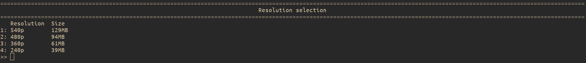

Command line arguments
======================

This section documents all the command line arguments available.

Options
-------

- `-c, --config <config-file>                                  `       Sets a custom config file location.
The default is `$XDG_CONFIG_HOME/peertube-viewer-rs/config.toml` or `$HOME/.config/peertube-viewer-rs/config.toml`

- `-i, --instance <instance>                                   `       instance to be browsed (default is [video.ploud.fr](https://video.ploud.fr))
- `-p, --player <player>                                       `       player to play the videos with
- `    --player-args <player-args>...                          `       arguments to be passed to the player
- `    --torrent-downloader <torrent-downloader>               `       choose the torrent software to download the videos with
- `    --torrent-downloader-args <torrent-downloader-arguments>`       arguments to be passed to the torrent downloader

The videos are played with the command: `player <player-args> <url>`.
This is the same with the torrent when `--use-torrent is specified`.

flags
-----

-   `    --print-default-config     `    prints the default confing to stdout and exit
This is useful to get started on a config file. See [configuration](../config.md) for more details

-   `    --print-full-example-config`    print an example of all possible config options and exit

-   `-s, --select-quality           `    When playing a video with this option, the user will be prompted to chose the video quality

-   `    --use-torrent              `    will download the video via the torrent downloader instead of playing it.
This requires a torrent downloader to be set (either via the corresponding option or in the configuration file)

-   `-t, --trending                 `    will download the video via the torrent downloader instead of playing it.

-   `    --use-raw-url              `    the url to the video file will be passed to the player instead of the url to the web interface to watch it. It may be necessary for players without native support for peertube such as vlc. Some players (ex : mpv) may be able to show the video title in their interface if this option isn't used.

-   `    --tag-nsfw                 `    Tag nsfw results. This is the default behavior. This flag is only useful to override the config file
-   `    --block-nsfw               `    Block nsfw search results
-   `    --let-nsfw                 `    Don't tag nsfw results

-   `    --color                    `    force coloring of output if it is disabled in the config file
-   `    --no-color                 `    remove coloring of output

-   `-h, --help                     `    Prints help information
-   `-V, --version                  `    Prints version information

Initial query
-------------

It is possible to launch **peertube-viewer-rs** with a query.

For example, `peertube-viewe-rs mastodon` will launch **peertube-viewer-rs** and immediately search for mastodon.
It is also possible to set the instance that way: `peertube-viewer-rs https://skeptikon.fr mastodon` will search for mastodon videos on the instance skeptikon.fr.

You can also play a single video with its url: `peertube-viewer-rs https://peertube.social/videos/watch/baf47864-08d8-483f-8518-9a973f99aac8` will play the video.
