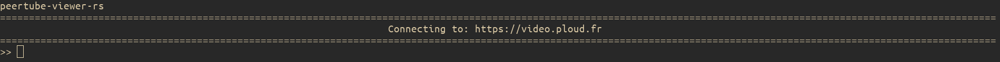
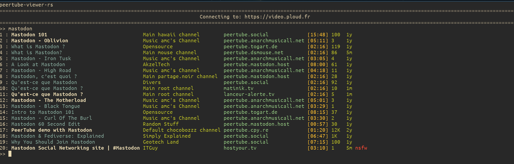
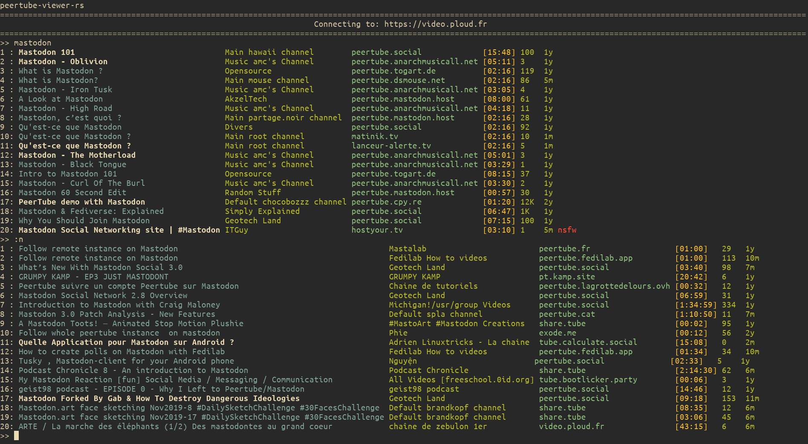

usage
=====

When launching **peertube-viewer-rs** you will be prompted to enter a search.

You can then enter a search and will be displayed the results with:

- the name of the video
- the name of the channel
- the host instance
- the duration of the video
- the view count of the video
- the time since the video was posted
- a nsfw tag for video tagged as such

The white/bold results are those that you have already been watched.

You can either play one of the results by typing its id or get more results with `:n`

At any moment you can quit with `:q`

Here is a list of all the command that can be ran during a session:

- `:q` quit (`ctrl-D` and `ctrl-C` have the same effect)
- `:n` get more results for the same search or get more trending results when browsing trending
- `:p` go back to the previous results (the opposite of `:n`)
- `:trending` start browsing trending results
