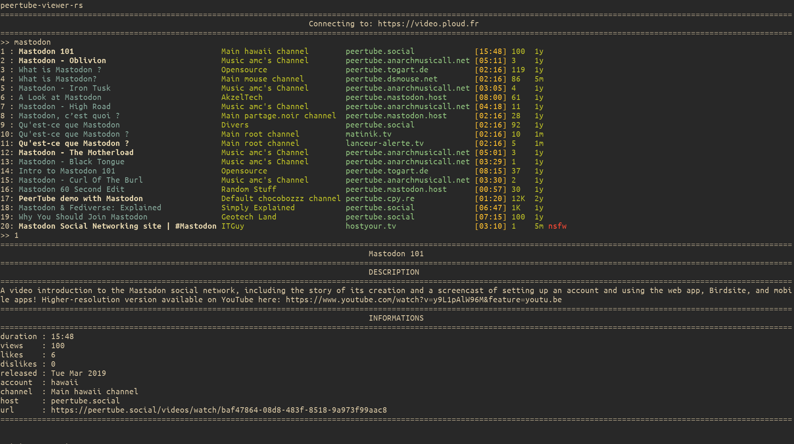

peertube-viewer-rs
==================

**peertube-viewer-rs** is a small utility to enable you to browse videos available on any [peertube](https://joinpeertube.org) instances, without having to launch a web browser.
It is heavily inspired from [youtube-viewer](https://github.com/trizen/youtube-viewer).

Usage
-----

Here is a screenshot of a basic usage of **peertube-viewer-rs**.
When launching  you are prompted with a search input.
Once a search is done, you can either select one of the results by writing the corresponding number or do another search by typing anything else.
When you chose to play a video, it will be launched in a video player ([mpv](https://github.com/mpv-player/mpv) by default)

peertube-viewer and peertube-viewer-rs
--------------------------------------

**peertube-viewer-rs** is a rewrite in rust of [peertube-viewer](https://gitlab.com/SostheneGuedon/peertube-viewer).
Though the implementation language doesn't matter for the end user, the name has been changed since breaking changes have been introduced, mainly in the configuration.

